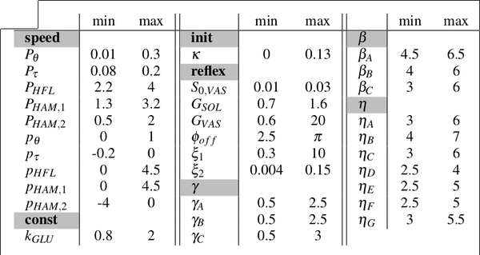

# Repository for semester project : TITLE

## Milestones

### 1. Setting up the environment for desktop + laptop
- Webots -> OK
- Matlab ?
- Python  -> OK, see ./config
- Other : Mokka ?

### 2. Parameter influence
 Evaluate the influence of the tunable parameters on the gait, both for the muscle reflex model and CPG+reflex model.

1. Determine which parameters to study (literature)

	- Muscle reflex model :

	<!--![Muscle reflex model parameters [@Geyer2010AMM]](./figures/reflex_params.png)-->
	![Muscle reflex model parameters interpretation [@Geyer2010AMM]](./figures/table_param_muscle.svg)

	- CPG + muscle reflex :

	

2. Simulate the model with these parameters set to zero (or minimal bound value)

	As the minimum bound value is not a mathematical constraint, it would be safe to test values below (test zeros), to see how the model behaves

	> See how/which data is saved, and how I can import it with python

	
3. Compare with the optimized model, both visually (is it still working/stable) and numerically (similitudes on joint angles/position, muscle activations...) -> see what is applicable
	- Energy (cost of travel)
	- Similarity in angles, torques
	- Stride lenght
	- Stability (just binary or is there a metric ?)
	- Speed
	- Impact of terrain

4. Implement result analysis/plotting functions

### 3. Fitting model to experimental data

1. Select data (MOCAP) from a real subject (healthy/pathological)
2. Pre-process (normalize stride lenght, maybe mean values)
3. Fitness function
	- Multi-objective optimization
	 	- similarity in angles/torques
	 	- maximize speed
	 	- minimize energy
	 	- maximize stability (worst measure with different terrains)
4. Which GA (explore DEAP library (python))
	- Multi-objective optimization algorithm (NSGA-II ?)
5. Melt 3 clusters until good fit

### 3b. Alternative : Optimize model with pathological constraints

Idea would be to remove some components of the model in order to characterize a pathology (eg. ankle angle feedback for diabetes), and evolve the model from there.
The goal would be to see if we observe a similar gait (eg. flat footed for diabetes).
For the muscle-reflex model (FBL), this could correspond (?) of setting $G_{TA}$ to zero  (gain for TA length feedback)

### 4. Evaluate

Once the best set of parameters to fit the data is found, evaluate :

1. Gait similarity (parameters not considered in fitness function)
2. EMG values
3. Biological interpretation

## Progress

- Weeks 1-3 : litterature review, project organisation and environment setup
- Week 4 : 
	- Import a run result from raw files (maybe refactor a bit the logger to write in a single csv file)
	- Launch a batch of runs with different parameters
	- Plot the results
